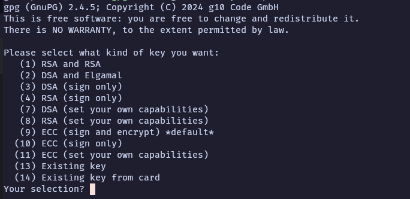
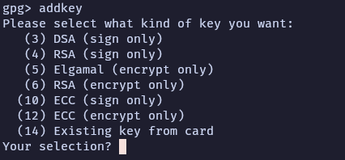

Let's generate a proper key this time.  

<!-- truncate --> 

## Proposed Setup  

The entire setup is done keeping some [principles we discussed over here](../gpg_keys_handle)

- GnuPG v>=2.4.5
- Single primary capable of [C]ertify (which will be taken offline after creation)
- Multiple subkeys for [S]igning, [E]ncryption (host specific). 
- (Optional) a WKD service hosted via GitHub Pages  
- GnuPG is set with sane defaults as defined here.  

## Key Generation  

### Primary Key  

This is our one and only main key. You should only use one primary key and create subkeys for other purposes. Of course, we'll need to create separate primary keys for Work and Personal emails when needed.  

Fire up the terminal, and execute  

```bash
gpg --full-generate-keys --expert --allow-freeform-uid  
```
The `--allow-freeform-uid` is optional, and needed only if you want choose a shorter name, or any other non-standard text. 

You'll get a screen like this.  



Chose the option **(11)**. By default, the primary key will have [C]ertify and [S]gn capabilities. We won't be doing that. We'll use our primary key just for [C]ertify. That's why we chose the **Set your owncapabilities** route. 


Enter **S** to toggle the [S]ign capability. If you've a different screen, choose the appropritate toggles, and make sure the current allowed actions is set to only [C]ertify. Then press **Q** to finish.  


Choose the **Curve 25519 *default***  

Now it'll ask for the expiration of the key. While it might sound easy and tempting to go with never expire, we'll go with 2y as the expiraion time. Set a reminder for yourself to renew this (renewing expiratoin is not a tedious task) after 1 year. 


Press **y** to confirm the exipration date.  

Now, it'll ask for your Real Name, Email and Comment. Fill those details appropriately.  


Press **O** to confirm the details.  

Now, it'll ask for a passphrase. **Choose a STRONG yet easy-to-remember passphrase**. Also, it's worth noting that once you lose this passphrase, there's **no recovering it back**. 

Depending on the version of GnuPG, you'll see an output like this. Newer GnuPG versions also generates a revocation certificate by default. If you don't see one on your screen, don't worry, we'll create one at the end of this doc. It's a requirement of the principle we follow anyway.  


All right, that's enough for our primary key. Now let's create subkeys.  Keep note of the fingerprint displayed. We'll need that later.

### Signing Sub Key  

Now let's create a sub key exclusively for Signing. 

```bash
gpg --edit-key <fingerpint_of_your_key>

# If you missed the fingerpint earlier, you can retrieve it easily.
gpg --fingerprint <email_address>  
```
In the `gpg` prompt, type `addkey` and press Enter.  



The prompts from here is same as we did for primary key. So, please choose the options properly.

Choose Option **10) ECC (Sign only)**, and follow the prompts. Choose the default (**Curve 25519**) curve on the next step.  Also, set an expiration. 

It'll prompt the passphrase of the primary key. Once the process completes, you'll get a new sub key. Just for signing.  

:::info[Sign git commits with this key]

Usually, what I've done so far is that I'll create a primary key with the email I"m using to commit, which will have [SC] capabilities by default. And I'll set the `git config --global commit.gpgsign true` on my host. Since I use the same commiter name and email for gpg key, git will auto pick the GPG key. 

Boy, I was doing that so WRONG!. I could've gone with one single PK and a dedicated signing key, and I can use that key exclusively for signing commits. There was no need of multiple PKs. 

Now that I've learned my lesson in the hard way, you don't have to. Let's use this sub key for git commit signing, and use whatever commiter name in the git config.  

```bash
# Get the long ID of our key  
gpg --list-keys --keyid-format LONG <email>
```

This will list both our primary key and the newly created sub key. Choose the ID of the key which has [S] capability set.  

```bash
sub   ed25519/EC06AC695DE527A5 2024-07-07 [S] [expires: 2025-07-07]
```
The part after `ed25519/` is the key ID. Note this down, and execute the following commands.  

```bash
# Force Git Signing by default system wide  
git config --global commit.gpgsign true  

git config --global user.signingkey <key_id>
```

From nowonwards, all your commits will be signed using the UID we just created. We also need to upload our public key to the git hosting services such as (GitHub / GitLab) etc. But we'll get to that later in the doc down below.  

:::


### Encrypting Sub Key  

Follow the same steps as Signing Key. Just change the key option to **ECC (Encrypt only)** this time. Rest of the steps are exactly same. 


### Authentication Sub Key  

Same as above steps, but to get the [A]uthenticate capability in the menu, run the edit command with `--expert` option.  

```bash
gpg --expert --edit-key <fingerprint>  
```

Choose the option **ECC (Set your own capabilities)** to set the capability manually. 

### Revocation Key  

If you're on newer GnuPG versions, the revocation key will be autogenerated when you create the primary key. That revocation can be found here:  

```
~/.gnupg/openpgp-revocs.d/<primary_key_fingerprint>.rev  
```

:::danger[Keep this key in a secure place]

Make sure to save this revocation key somewhere safe. Importing this key to the keyring will revoke your primary key. 

:::

:::info[Revoking specific subkey]  

We've created several subkeys for the main UID. But we don't need each revocation ceritificate for each subkeys. Just go to the edit key mode, and type `revkey`, and follow the procedure.  

```bash
gpg --edit-key <fingerprint>  

gpg> revkey 
```

:::


## Verifying Keys  

Now, at this stage, you'll have one primary key and 3 subkeys for the UID. 

```bash
gpg --list-keys -k <email>
```


## Exporting Keys  

There are mainly two ways to export your public key and distribute among peers.  

- Export the public key as a file, and share it over internet or any other medium.  
- Use a Web Key Directory like [OpenPGP Keys](https://keys.openpgp.org) or [KeyBase](https://keybase.io), or better yet host your own. I've already documented how to host our on WKD via GitHub Pages [here](../2024-07-06-host-wkd-github.md).  

While exporting public key, we want to make it very minimal. The default `--export` would contain some metadata / comments that we won't need. To export, 

```bash
gpg --armor --export-options export-minimal --export-filter 'keep-uid=mbox~=@<your_domain>' --export-filter 'drop-subkey=usage !~s' --export "<fingerprint>"
```

Copy the output to a separate file, and distribute!. 

## Taking primary key offline

Now that we've created necessary keys, it's time to take them offline. By offline, we mean, delete the PK from the host, but save it in a secure place.

The most common use of GnuPG is signing documents / commits. For that we don't actually need the entire private key. Remember the sub key we created just for signing? That'd be enough to sign. 

:::info[Backing up, just in case]  

Since we're going to do a destructive operation, it's always good to take the backups.  

```bash
gpg --armor --output <name>.keys.asc --export-secret-key <uid>  
```

:::

- Step 1: Find the keygrip of PK  

```bash  
gpg --list-secret-keys --with-keygrip  
```

- Step 2: Copy the keygrip, and execute the following:  

```bash  
gpg-connect-agent "DELETE_KEY <keygrip>" /bye  
```

- Step 3: Validate the key has been removed  

```bash  
gpg --list-secret-keys <uid> 
```  

You should see a `sec#` prefix on your primary key. The `#` means that it failed to find the primary key.  

